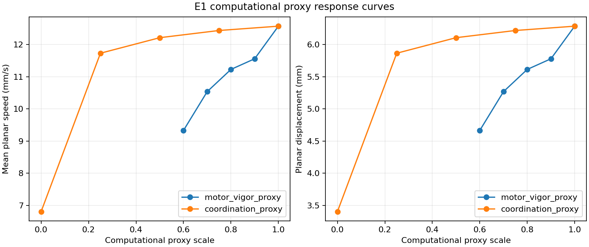
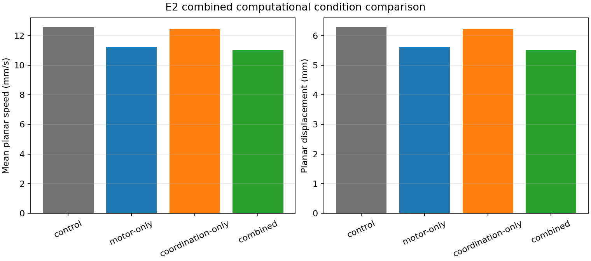
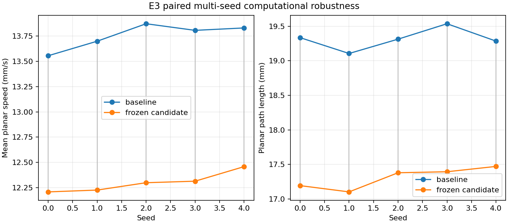
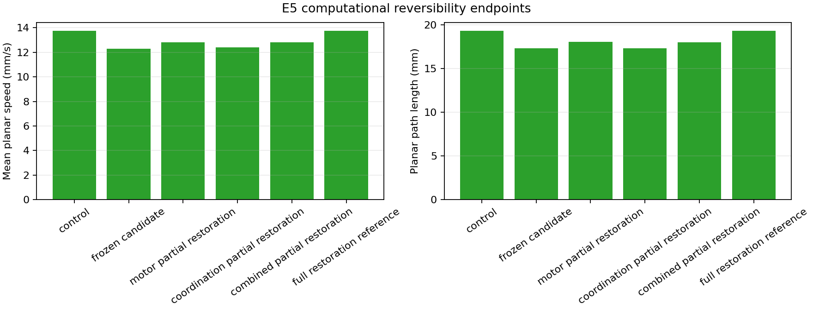

# Reproducible Computational Drosophila Locomotion Phenotype Framework

## Abstract

### Motivation

Locomotor output provides a compact computational readout for studying how
controlled changes in a Drosophila simulation alter movement, coordination, and
body-state metrics. This work establishes a staged evidence framework in which
software state, simulation behavior, response surfaces, robustness, qualitative
literature comparison, and reversibility are kept separate.

### Approach

The workflow used NeuroMechFly with FlyGym and MuJoCo to establish an
unperturbed flat-ground locomotion baseline. Two phenomenological computational
proxies were then applied through explicit interfaces: global scaling of
joint-angle commands and scaling of CPG inter-leg coupling. Response surfaces
were measured in controlled paired conditions, followed by a fixed combined
candidate, five-seed validation, a qualitative adult walking comparison, and a
preregistered computational reversibility experiment. An evidence-only
synthesis validated the frozen reports, provenance, and generated artifacts.

### Findings

The unperturbed baseline used a 0.5 s simulation with a 0.0001 s timestep and
5000 steps. It produced 6.284186050286936 mm planar displacement,
12.568372100573873 mm/s mean planar speed, and a compiled control dimension of
48, consisting of 42 position and 6 adhesion actuators. Motor-command scaling
produced a graded locomotor-output response and exact action-magnitude scaling.
CPG coupling reduction had modest intermediate effects and a large output loss
and yaw deviation at zero coupling. The frozen computational candidate used
`motor_scale = 0.8` and `coupling_scale = 0.75`. Across seeds 0 through 4, its
displacement and speed deltas were negative in every paired comparison.

The selected adult walking comparisons were directionally concordant for four
speed or distance endpoints, while other endpoints remained incomparable or
insufficiently supported. The resulting E4 status is
`PARTIAL_PHENOTYPE_CONCORDANCE`. Computational restoration was more consistent
along the motor axis than for coordination-only restoration.

### Boundary

These results characterize a reproducible computational phenotype framework.
They do not establish a biologically validated Parkinson's disease model,
dopamine depletion, neuron loss, disease severity, mechanistic equivalence,
biological rescue, or statistical significance. The candidate is frozen for
further validation as a computational configuration only.

## 1. Introduction

This report presents a reproducible computational framework for measuring
Drosophila locomotion phenotypes in simulation. Locomotor output is useful here
because the configured model exposes movement, directional, action, adhesion,
and body-height observables under controlled software conditions. The purpose
is to make those observations reproducible before assigning them any biological
interpretation.

The framework is staged because a simulation result depends on more than the
parameter being studied. Fly construction, joint materialization, actuator
compilation, controller timing, world configuration, random seed, observation
collection, and metric definitions must be checked separately. The repository
therefore treats the unperturbed baseline, controlled perturbations,
parameter-response experiments, multi-seed validation, literature comparison,
computational reversibility, and evidence synthesis as distinct evidence
layers.

The literature layer is deliberately limited to selected adult walking
observations already curated in the repository. Riemensperger et al. reported
lower walking speed and covered distance in an adult dopamine-deficiency
context [1]. Chen et al. reported reduced walking measures in old adult A30P
flies, including walking velocity and total moving distance [2]. The current
framework compares directions qualitatively; it does not fit simulation
parameters to those measurements.

The scope of this report is computational reproducibility and phenotype
characterization. It does not define a biological disease condition.

## 2. Methods

### 2.1 Software and simulation environment

The frozen simulation evidence was generated in Google Colab with Python
3.12.13, FlyGym 2.1.0, and MuJoCo 3.9.0. The canonical pipeline uses
NeuroMechFly, post-materialization joints, FlyGym `FlatGroundWorld`,
`Simulation`, `PreprogrammedSteps`, and the official CPG controller source
used by the baseline. E6 itself is an evidence-only analysis layer and does
not execute FlyGym or MuJoCo.

### 2.2 Unperturbed locomotion baseline

The unperturbed baseline creates a fresh fly, materializes the required
locomotor joints through the canonical gate, adds 42 position actuators and 6
adhesion actuators, creates the flat-ground world and simulation, and records
finite observations and derived metrics. The frozen protocol uses a 0.5 s
duration, a 0.0001 s timestep, and 5000 simulation steps. Rendering is not
required for numerical baseline validation.

**Table 1. Canonical computational conditions and parameters.**

| Condition or analysis | Computational settings | Primary outputs or purpose |
| --- | --- | --- |
| Unperturbed baseline | 0.5 s; timestep 0.0001 s; 5000 steps; 42 position actuators; 6 adhesion actuators; `nu = 48` | Baseline locomotor output and finite metrics |
| Motor-vigor response | Global joint-angle command scales 1.00, 0.90, 0.80, 0.70, 0.60 | Displacement, speed, yaw, height, action response |
| Coordination response | CPG coupling scales 1.00, 0.75, 0.50, 0.25, 0.00 | Displacement, speed, yaw, height, action response |
| Frozen candidate robustness | `motor_scale = 0.8`; `coupling_scale = 0.75`; 1.0 s; seeds 0-4; paired fresh state | Multi-seed displacement, speed, path, efficiency, yaw, height |
| Computational reversibility | Fixed midpoint restorations; primary endpoints speed and path length | Movement toward the unperturbed computational control |

### 2.3 Controlled perturbation framework

Each paired condition creates a fresh fly, world, and simulation. Seed, duration,
timestep, world, spawn, baseline controller, skeleton, actuator architecture,
adhesion configuration, and metric definitions are held constant within a
comparison. Perturbations are applied through explicit interfaces and recorded
in the resulting JSON evidence.

An identity condition verified that the paired pipeline preserves the baseline.
The action-scale condition applied a global scale of 0.8 to the 42 joint-angle
commands, preserved adhesion commands, and reported a zero command-transform
error. This is a software control check, not a biological intervention.

### 2.4 Motor-vigor computational proxy

The motor-vigor proxy scales the global joint-angle command vector. The E1
response surface sampled scales 1.00, 0.90, 0.80, 0.70, and 0.60. The proxy
is a computational action transformation. It is not a calibrated measurement
of dopamine, neuron loss, or any biological severity variable.

### 2.5 Coordination computational proxy

The coordination proxy scales the CPG inter-leg coupling weights. The E1
response surface sampled coupling scales 1.00, 0.75, 0.50, 0.25, and 0.00.
This changes controller coordination while leaving global action magnitude
largely unchanged in the recorded response. It is likewise a computational
proxy rather than a biological mapping.

### 2.6 Parameter-response analysis

E1 measured displacement, mean speed, yaw change, body height, and action
magnitude across each proxy family. E2 evaluated a nine-condition combined
matrix containing the unperturbed control, motor-only conditions, coordination-
only conditions, and combined conditions. Combined response effects were
compared with the corresponding single-proxy responses, with particular care
given to nonlinear directional effects.

### 2.7 Combined candidate selection

The frozen candidate was selected from the E2 response surface before the E3
run. It uses `motor_scale = 0.8` and `coupling_scale = 0.75`. No E3, E4, E5,
or E6 step tunes this candidate. It remains a computational candidate for
further validation, not a disease designation.

### 2.8 Multi-seed robustness validation

E3 ran the unperturbed and candidate conditions for seeds `[0, 1, 2, 3, 4]`,
using the same seed within each pair, fresh simulation state per condition,
and a 1.0 s duration. The candidate transformation, controlled variables,
finite observations, and finite derived metrics were checked. The frozen
classification `ROBUST` means computational/software robustness under these
tested seeds only.

### 2.9 Literature-grounded concordance

E4 mapped selected adult walking endpoints to the closest available simulation
metrics using direction-only qualitative comparisons. Walking speed and
walking velocity were compared with mean planar speed. Covered or total moving
distance was compared primarily with planar path length and secondarily with
planar displacement. Distance per movement, angular velocity, centrophobism,
and body height were not treated as directly validated endpoints. No direct
numeric calibration or aggregate disease score was created.

### 2.10 Computational reversibility experiment

E5 used fixed midpoint restorations from the frozen candidate toward the
unperturbed control. Its primary endpoints were mean planar speed and planar
path length. The motor partial condition used `0.9/0.75`, coordination partial
used `0.8/0.875`, combined partial used `0.9/0.875`, and the full restoration
reference used `1.0/1.0`. Recovery fractions describe movement toward the
computational control in the tested configuration. They are not biological
recovery measurements.

### 2.11 Evidence synthesis and reproducibility

E6 reads exactly eight frozen JSON reports, validates schemas, pass states,
provenance, candidate identity, SHA-256 hashes, scientific-boundary wording,
and artifact inventory, then generates four figures and five CSV tables. It
passed 56 checks. The frozen synthesis records its source commit and the
known dirty historical Session 02 notebook in provenance; that notebook was
not used as a scientific input and was preserved unchanged.

## 3. Results

### 3.1 Unperturbed locomotion baseline

The unperturbed baseline passed its Colab integration checks. It produced
6.284186050286936 mm planar displacement and 12.568372100573873 mm/s mean
planar speed. Heading yaw change was 0.2342730946151257 rad. Thorax height
was 0.7660532202481788 mm at its minimum, 0.946592192150494 mm on average,
and 1.0115140447050612 mm at the final recorded value. Observations and
derived metrics were finite.

### 3.2 Controlled perturbations behaved as specified

The identity comparison passed with zero deltas across the recorded scalar and
adhesion metrics. The global action-scale condition transformed the 42
joint-angle commands with scale 0.8 and preserved adhesion commands. Relative
to its paired baseline, it changed planar displacement by
-0.6714494674507625 mm and mean planar speed by -1.342898934901525 mm/s. The
absolute joint-action mean changed by -0.20487402724275616, while adhesion
duty-factor deltas were zero. These checks establish controlled software
behavior for the later response experiments.

### 3.3 Motor-vigor and coordination response curves

Motor-command scaling produced a graded decrease in displacement and speed
from the scale-1.00 control to the scale-0.60 condition. At scale 0.80, the
recorded displacement was 5.612736582836174 mm, mean speed was
11.225473165672348 mm/s, and action absolute mean was 0.8194961089710263.
At scale 0.60, displacement was 4.665347652380944 mm and mean speed was
9.330695304761887 mm/s. Action magnitude followed the commanded scaling
exactly. Body height changed nonlinearly and yaw was not monotonic.

Coordination reductions had modest intermediate effects. At coupling 0.75,
displacement was 6.21723627703009 mm and mean speed was 12.43447255406018
mm/s. At coupling 0.50, displacement was 6.105537853973774 mm and mean speed
was 12.211075707947549 mm/s. At zero coupling, displacement fell to
3.405436197366035 mm, mean speed to 6.81087239473207 mm/s, and yaw change rose
to 2.2263880793047 rad. Action absolute mean remained 1.0239380323964007 at
zero coupling, consistent with the proxy changing coordination rather than
global action amplitude.



*Figure 1. Simulated displacement, speed, yaw, height, and action response
across motor-vigor and coordination computational proxy scales. Motor scaling
produces a graded locomotor-output response with exact action scaling; coupling
reduction is modest at intermediate values and has a large output and yaw
effect at zero coupling. These are computational response surfaces, not
biological severity curves.*

### 3.4 Combined perturbations and candidate selection

The nine-condition E2 matrix showed that the combined effects on speed and
displacement were mostly close to additive. Directional effects were more
nonlinear. The combined candidate `0.8/0.75` produced 5.513499489822533 mm
displacement, 11.026998979645066 mm/s mean speed, 0.30259921850584254 rad yaw
change, and 1.478905964396374 mm mean height. The `0.7/0.75` and `0.7/0.5`
conditions produced 5.136531853151933 mm and 5.029479715627041 mm displacement,
respectively. The candidate was retained for further validation without
assigning it a biological label.



*Figure 2. Control, single-proxy, and combined computational conditions. Speed
and displacement responses are mostly close to additive, while yaw responses
are more nonlinear. The figure does not identify a disease condition.*

### 3.5 Multi-seed robustness

For the frozen candidate, mean displacement was 13.751281674590993 mm in the
paired baseline and 12.302040063313584 mm in the candidate, a relative delta
of -10.53649998704906%. Mean speed had the same aggregate values and relative
delta because the E3 duration was fixed at 1.0 s. Mean path length changed
from 19.31485503067457 mm to 17.308442670909542 mm, a relative delta of
-10.386359062038664%.

Trajectory efficiency changed from 0.7119806020699851 to
0.7107636180753024, a relative delta of -0.16292589177790413%. Joint action
absolute mean changed from 1.0256368082597096 to 0.820559121832831, a relative
delta of -19.995156821323032%. Mean body height changed from
0.9465522152698778 mm to 1.4910686043526398 mm, and absolute yaw change
changed from 0.10385794490113649 rad to 0.21120580249246884 rad.

All five displacement and speed deltas were negative. Trajectory-efficiency
deltas were mixed, absolute-yaw-change delta was positive in four of five
seeds, and body height remained an important confound.

**Table 2. E3 aggregate robustness summary.**

| Metric | Baseline mean | Candidate mean | Relative delta |
| --- | ---: | ---: | ---: |
| Displacement (mm) | 13.751281674590993 | 12.302040063313584 | -10.53649998704906% |
| Mean speed (mm/s) | 13.751281674590993 | 12.302040063313584 | -10.53649998704906% |
| Path length (mm) | 19.31485503067457 | 17.308442670909542 | -10.386359062038664% |
| Trajectory efficiency | 0.7119806020699851 | 0.7107636180753024 | -0.16292589177790413% |
| Joint action absolute mean | 1.0256368082597096 | 0.820559121832831 | -19.995156821323032% |



*Figure 3. Baseline and frozen-candidate speed and path-length outputs for
paired seeds 0 through 4. Each pair shares a seed and each condition uses
fresh simulation state. Candidate displacement and speed deltas are negative
for all five seeds. `ROBUST` denotes computational/software robustness under
the tested seeds only.*

### 3.6 Qualitative adult walking concordance

E4 classified the comparison as `PARTIAL_PHENOTYPE_CONCORDANCE`. Four selected
adult speed or distance endpoints were directionally concordant, three were
not comparable, and one was insufficiently supported. The concordance was
direction-only: the simulation candidate's lower speed and distance outputs
were compared with the lower directions documented in the selected adult
walking evidence. No direct numerical calibration was used.

**Table 3. E4 endpoint concordance summary.**

| Literature endpoint group | Simulation metric | Classification | Interpretation |
| --- | --- | --- | --- |
| Walking speed / velocity | Mean planar speed | CONCORDANT | Directionally comparable only |
| Covered / total moving distance | Path length; displacement supplemental | CONCORDANT | Directionally comparable only |
| Distance per movement | None | NOT_COMPARABLE | Movement bouts are not segmented |
| Angular velocity | Yaw change | NOT_COMPARABLE | Yaw change is not angular velocity |
| Centrophobism | None | NOT_COMPARABLE | Open-field center avoidance is not modeled |
| Thorax/body height | Body-height mean | INSUFFICIENT_EVIDENCE | No selected matching target |

This classification is a literature-grounded qualitative layer, not biological
validation.

### 3.7 Computational reversibility

E5 tested fixed partial returns toward the unperturbed control. Motor partial
restoration had speed recovery fraction 0.34260277654496735 and path recovery
fraction 0.3769885932181204, with `DIRECTIONALLY_RESCUED` classification on
both primary endpoints. Coordination-only restoration had speed recovery
0.05819831544405736 and path recovery 0.007263689687290947, with `MIXED`
classification. Combined partial restoration had speed recovery
0.36014860249643493 and path recovery 0.35399358544714715, with
`DIRECTIONALLY_RESCUED` classification. The full computational restoration
reference reproduced the control configuration and is classified as a
reference, not a rescue condition.

**Table 4. E5 computational reversibility summary.**

| Restoration condition | Speed mean | Speed recovery | Path mean | Path recovery | Classification |
| --- | ---: | ---: | ---: | ---: | --- |
| Motor partial (`0.9/0.75`) | 12.798554263221726 | 0.34260277654496735 | 18.06483724383281 | 0.3769885932181204 | DIRECTIONALLY_RESCUED |
| Coordination partial (`0.8/0.875`) | 12.38638348376136 | 0.05819831544405736 | 17.32301662767562 | 0.007263689687290947 | MIXED |
| Combined partial (`0.9/0.875`) | 12.823982404294824 | 0.36014860249643493 | 18.018699776028235 | 0.35399358544714715 | DIRECTIONALLY_RESCUED |
| Full computational reference (`1.0/1.0`) | 13.751281674590993 | 1.0 | 19.31485503067457 | 1.0 | REFERENCE |

Motor-axis restoration was more consistent than coordination-only restoration
for the primary endpoints. These are computational movements toward a control
configuration, not biological recovery measurements.



*Figure 4. Primary speed and path-length endpoints for the frozen candidate,
partial restorations, and full computational restoration reference. Motor and
combined restorations move endpoints toward control in the tested conditions;
coordination-only restoration is mixed. This is computational reversibility,
not biological rescue or treatment response.*

### 3.8 Evidence synthesis

The E6 evidence-only synthesis passed all 56 checks. It represented exactly
eight upstream frozen reports, verified their SHA-256 manifest and provenance,
and generated four figures and five CSV tables. E4 remained
`PARTIAL_PHENOTYPE_CONCORDANCE`; E5 remained computational reversibility only.
No statistical-significance claim was introduced.

## 4. Discussion

### 4.1 Supported computational interpretation

The frozen evidence supports three computational observations. First,
global scaling of joint-angle commands generated a graded locomotor-output
response and changed action magnitude as specified. Second, CPG coupling
manipulation generated a distinct coordination and directional response, with
modest intermediate effects and a pronounced response at zero coupling. Third,
the combined `0.8/0.75` candidate reduced displacement, speed, and path length
relative to paired baselines across all five tested seeds.

The response surfaces also show why locomotor output cannot be reduced to one
number. Body height changed substantially under motor-command scaling, yaw was
nonlinear, and trajectory-efficiency changes were mixed across seeds. These
quantities are part of the computational phenotype and constrain simple
interpretation of displacement or speed alone.

### 4.2 Qualitative literature concordance

The selected adult walking evidence records decreased speed or distance in the
contexts described by Riemensperger et al. [1] and Chen et al. [2]. The frozen
candidate showed decreased simulated speed and distance, so E4 records
directional qualitative concordance for those selected endpoints. The explicit
status is `PARTIAL_PHENOTYPE_CONCORDANCE` because distance per movement,
angular velocity, centrophobism, and body-height interpretation remain
unavailable, non-comparable, or insufficiently supported.

### 4.3 Computational reversibility and unresolved observations

E5 indicates that fixed computational restoration along the motor axis and the
combined axis moved the primary endpoints toward control more consistently than
coordination-only restoration. This result is useful for characterizing the
software response surface and the separability of the two proxies. It does not
identify a biological recovery mechanism.

The large body-height response, nonlinear yaw response, mixed efficiency
changes, and differences between net displacement and path length remain
important unresolved features. They should be reported alongside locomotor
output rather than treated as noise without further study.

### 4.4 Requirements for future biological validation

Further biological interpretation would require literature-backed definitions
of the target fly phenotypes, measurements comparable to the simulation
endpoints, a defensible biological interpretation of controller and actuator
changes, and a prespecified uncertainty and replication plan. In particular,
the project would need to distinguish a computational action transformation
from a biological perturbation and to test any proposed mapping against
independent experimental evidence.

None of the present results establishes a mechanistically validated
Parkinson's disease model.

## 5. Limitations

### 5.1 Proxy design and biological scope

The motor-vigor and coordination variables are phenomenological computational
proxies. There is no dopamine-level calibration, neuron-loss mapping, or
Parkinson's disease severity mapping. No pharmacological or L-DOPA model is
implemented. E5 is computational reversibility only and does not establish
biological rescue or treatment response. No mechanistic equivalence between a
proxy and a biological disease process is claimed.

### 5.2 Endpoint and model limitations

The metrics are outputs of the configured FlyGym model and controller. Body
height changes substantially in some conditions and may confound locomotor
interpretation. Yaw change is angular displacement over the run, not angular
velocity. The current model does not provide movement-bout distance,
centrophobism, negative geotaxis, pause, or freezing endpoints. The selected
literature scope is limited to the adult walking evidence curated for E4.

### 5.3 Robustness and inference limitations

E3 tested five paired seeds for one frozen candidate. The `ROBUST`
classification therefore means computational/software robustness under those
tested seeds only. It does not mean biological robustness or statistical
significance. The frozen evidence contains no inferential statistical
significance claim, and no arbitrary biological threshold was introduced.

### 5.4 Duration and software dependence

The baseline and validation protocols characterize their specified short
simulation durations and do not cover all timescales or environmental
conditions. Reproduction depends on the pinned Python 3.12.13, FlyGym 2.1.0,
and MuJoCo 3.9.0 stack. Upstream simulation reports require the documented
Colab environment, while E6 synthesis is evidence-only and does not require a
new simulation.

## 6. Reproducibility

The repository is the source of truth for reusable code, configurations,
frozen evidence, and this manuscript. Google Colab is the execution environment
for the upstream FlyGym/MuJoCo reports. The E6 synthesis can be rebuilt with:

```bash
python scripts/run_evidence_synthesis.py \
  --config configs/analysis/milestone_e6.yaml \
  --output results/analysis/milestone_e6_synthesis.json
```

The E6 report records synthesis commit
`53e41d17365f56509ca708ba3352ddf724b0e89a`, eight input reports, SHA-256
provenance, 56 passing checks, four figures, and five tables. Detailed stage
commands, input commits, artifact paths, and verification commands are in
[reproducibility.md](reproducibility.md). Claim-level mappings are in
[evidence_traceability.md](evidence_traceability.md).

## 7. Conclusion

This work provides a reproducible computational Drosophila locomotion
phenotype framework with an unperturbed baseline, explicit perturbation
interfaces, response surfaces, multi-seed validation, qualitative adult
walking concordance, computational reversibility, and evidence synthesis.
The frozen candidate `motor_scale = 0.8`, `coupling_scale = 0.75` is a
computational configuration with directionally robust simulated locomotor
output under the tested protocol. E4 remains
`PARTIAL_PHENOTYPE_CONCORDANCE`, and E5 remains computational reversibility
only. The framework is not a validated Parkinson's disease model, and further
biological interpretation requires external evidence.

## References

1. Riemensperger T, Isabel G, Coulom H, Neuser K, Seugnet L, Kume K,
   Iche-Torres M, Cassar M, Strauss R, Preat T, Hirsh J, Birman S. Behavioral
   consequences of dopamine deficiency in the Drosophila central nervous
   system. *Proceedings of the National Academy of Sciences of the United
   States of America*. 2011;108(2):834-839. DOI:
   [10.1073/pnas.1010930108](https://doi.org/10.1073/pnas.1010930108).
   PMID: 21187381.

2. Chen AY, Wilburn P, Hao X, Tully T. Walking deficits and centrophobism in
   an alpha-synuclein fly model of Parkinson's disease. *Genes, Brain and
   Behavior*. 2014;13(8):812-820. DOI:
   [10.1111/gbb.12172](https://doi.org/10.1111/gbb.12172). PMID: 25113870.

## Appendix A. Frozen evidence chain

The frozen evidence chain is:

1. Pre-materialization anatomy audit and reproduction.
2. Explicit joint materialization and post-materialization validation.
3. Unperturbed locomotion baseline.
4. Controlled identity and action perturbation checks.
5. Motor-vigor and coordination parameter-response experiments.
6. Combined perturbation experiment and candidate selection.
7. Five-seed candidate robustness validation.
8. Qualitative adult walking concordance.
9. Preregistered computational reversibility.
10. Evidence-only synthesis and artifact validation.

The detailed milestone identifiers and frozen input paths are preserved in
[reproducibility.md](reproducibility.md).

## Appendix B. Reproduction commands

The canonical E6 command is shown in Section 6. Upstream commands for the
baseline, controlled perturbations, response surfaces, robustness,
concordance, and reversibility experiments are maintained in
[reproducibility.md](reproducibility.md). This manuscript assembly did not
rerun those simulations.

## Appendix C. Evidence traceability

The claim-to-report mapping, source fields, scientific boundaries, and numerical
consistency rules are maintained in
[evidence_traceability.md](evidence_traceability.md). The modular documents
[methods.md](methods.md), [results.md](results.md), [discussion.md](discussion.md),
[limitations.md](limitations.md), [figure_captions.md](figure_captions.md), and
[README.md](README.md) remain the supporting report components.
